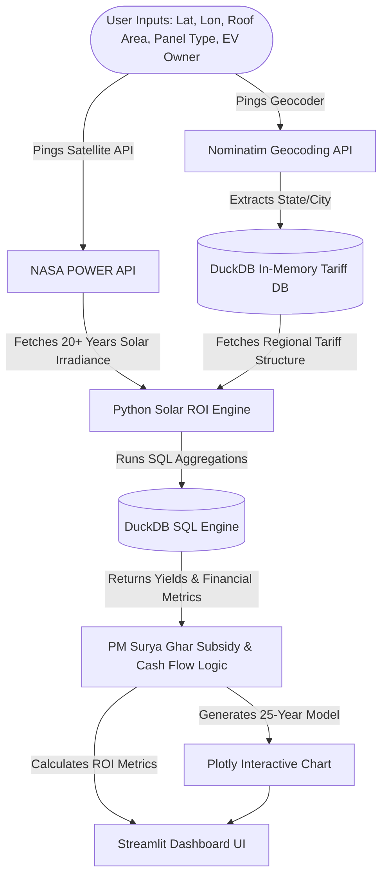

# ☀️ **Urban India Solar Investment Decision Engine**

[](https://solar-investment-engine.streamlit.app/)

A professional, full-stack SaaS data product designed to help residential and commercial property owners in urban India calculate the precise return on investment (ROI) for installing solar panels. By combining location-specific satellite telemetry, state-level utility tariffs, and national subsidy structures, the engine models long-term financial viability with high precision.

---

## 🚀 Live Application

The application is deployed and live at:  
👉 **[https://solar-investment-engine.streamlit.app/](https://solar-investment-engine.streamlit.app/)**

---

## 📋 Project Overview

Installing solar panels in India is highly dependent on micro-climate conditions, local state electricity board (DISCOM) tariffs, and national financial incentives. This engine removes the guesswork by providing a personalized financial blueprint:

1. **Satellite-accurate Irradiance Data:** Dynamically retrieves historical climate data for the exact coordinates.
2. **State-specific Tariffs & Subsidies:** Automatically applies regional utility tariff rules and calculates national subsidy schemes (like the PM Surya Ghar Muft Bijli Yojana).
3. **25-Year Financial Forecast:** Generates a comprehensive cash flow simulation detailing the out-of-pocket setup costs, cumulative savings, and exact break-even point.

---

## 🛠️ Architecture & Tech Stack

The decision engine is powered by a real-time data engineering pipeline built entirely in Python:



### **Core Technologies:**
* **Language:** Python
* **Frontend Dashboard:** Streamlit (For a clean, interactive, user-friendly UI)
* **SQL Aggregation Engine:** DuckDB (In-memory analytical database for lightning-fast tabular computations)
* **Climate Data API:** NASA POWER API (Provides over 2 decades of solar irradiance telemetry based on GPS coordinates)
* **Geocoding API:** Nominatim (Performs reverse-geocoding of coordinates to identify Indian states/cities)
* **Data Visualization:** Plotly (Generates dynamic, interactive 25-year cumulative cash flow graphs)

---

## ✨ Key Features

* **📍 Dynamic Geocoding & Localized Tariffs:** Enter any latitude and longitude in India. The application automatically geolocates the state and retrieves the corresponding local electricity tariff rate.
* **☀️ NASA Satellite Telemetry Integration:** Queries NASA databases in real-time to obtain the average annual solar radiation ($kWh/m^2/day$) for your exact coordinates.
* **🏛️ PM Surya Ghar Subsidy Logic:** Dynamically calculates government subsidies based on current capacity-tier regulations (e.g., standard subsidy structures up to 3kW).
* **📈 25-Year Interactive Cash Flow Simulation:** An interactive Plotly chart modeling system costs, cumulative electric bill savings, battery/maintenance costs, and EV-owner premiums over 25 years to locate the exact year of break-even.

---

## 💻 Local Setup & Execution

Follow these steps to run the application locally on your machine:

### 1. Clone the Repository
```bash
git clone https://github.com/Ragadeepsai/solar-investment-engine.git
cd solar-investment-engine
```

### 2. Create and Activate a Virtual Environment (Recommended)
**On Windows (PowerShell):**
```powershell
python -m venv venv
.\venv\Scripts\Activate.ps1
```
**On macOS/Linux:**
```bash
python3 -m venv venv
source venv/bin/activate
```

### 3. Install Dependencies
```bash
pip install -r requirements.txt
```

### 4. Run the Streamlit Application
```bash
streamlit run app.py
```
This will launch the app in your default web browser (usually at `http://localhost:8501`).

---

*Architected and developed with ☀️ in India by Sai Ragadeep.*
